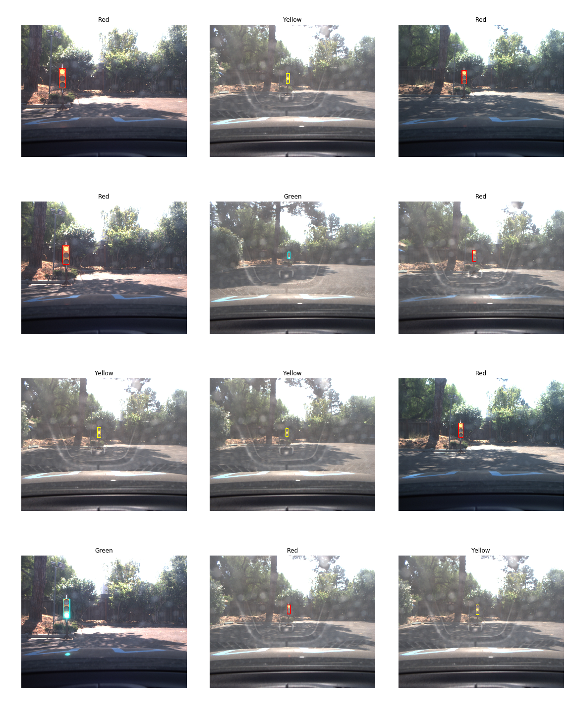
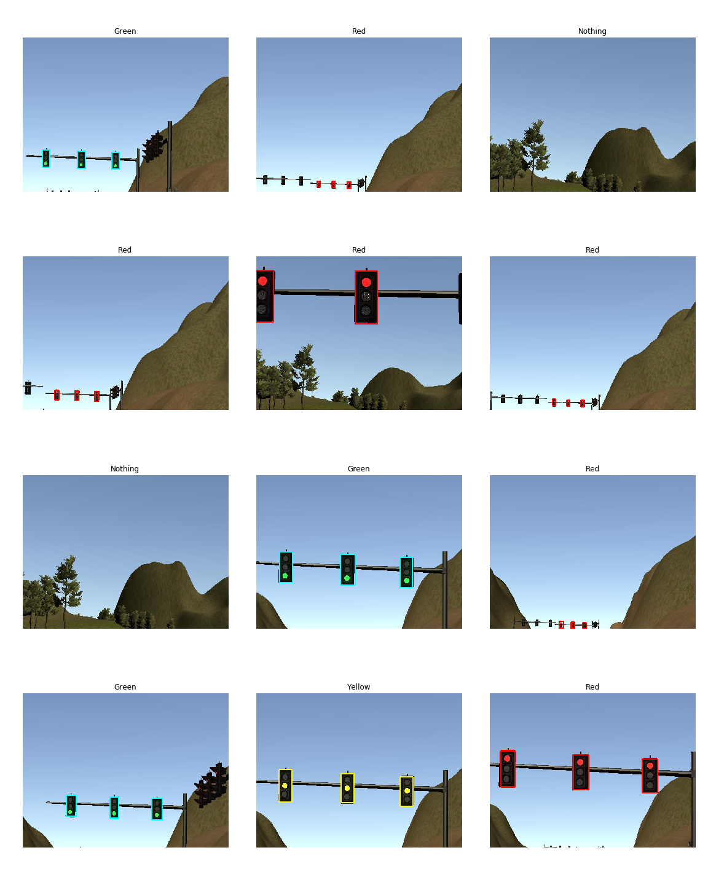

# Self-Driving Car using ROS  
#### Udacity Self-Driving Car Engineer Nanodegree - Capstone Project

## Team 4Tzones
  

|     Team Member     |            Email             |                    LinkedIn                            |  
|        :---:        |            :---:             |                      :---:                             |  
| Mohamed Elgeweily   | mohamed.elgeweily@gmail.com  | https://www.linkedin.com/in/mohamed-elgeweily-05372377 |  
| Jerry Tan Si Kai    | jerrytansk@gmail.com         | https://www.linkedin.com/in/thejerrytan                |  
| Karthikeya Subbarao | karthikeya108@gmail.com      | https://www.linkedin.com/in/karthikeyasubbarao         |  
| Pradeep Korivi      | pradeepkorivi@gmail.com      | https://www.linkedin.com/in/pradeepkorivi              |  
| Sergey Morozov      | ser94mor@gmail.com           | https://www.linkedin.com/in/aoool                      |  

All team members contributed equally to the project.

*4Tzones* means "Four Time Zones," indicating that team members were located in 4 different time zones 
while working on this project. The time zones are from UTC+1 to UTC+8.

## Software Architecture

Note that obstacle detection is not implemented for this project.

## Traffic Light Detection Node

A large part of the project is to implement a traffic light detector/classifier that recognizes the color of nearest upcoming traffic light and publishes it to /waypoint_updater node so it can prepare the car to speed up or slow down accordingly. Because the real world images differ substantially from simulator images, we tried out different approaches for both. The approaches which worked best are described below.

### Simulator - OpenCv approach
In this approach we used the basic features of OpenCv to solve the problem, the steps are described as below
* Image is trandformed to HSV colorspace, as the color feature can be extracted easily in this colorspace.
* Mask is applied to isolate red pixels in the image. 
* Contour detection is performed on the masked image.
* For each contour, area is checked and if it falls under the approximate area of traffic light, polygon detection is performed and checked if the the number of sides is more than minimum required closed loop polygon. 
* If the above conditons satisfy there is a red sign in the image. 

#### Pros
* This approach is very fast.
* Uses minimum resources.

#### Cons
* This is not robust enough, the thresholds need to be adjusted always.
* Doesnt work properly on real world data as there is lot of noise. 

### Test Lot - SSD (Single Shot Detection)
We need to solve both object detection - where in the image is the object, and object classification - given a localized image, classify the object in the image. While there are teams who approached it as 2 separate problems to be solved, recent advancements in Deep Learning has developed models that attempt to solve both at once - SSD (Single Shot Multibox Detection) and YOLO (You Only Look Once).

We attempted transfer learning using the pre-trained SSD_inception_v2 model trained on COCO dataset, and retrain it on our own dataset for NUM_EPOCHS, achieving a final loss of FINAL_LOSS.

@Segey, pls elaborate how you collated the dataset.

Here is a sample of the dataset.

Sample dataset for simulator images

Here are the results of our trained model.
(Insert image here!)

### Learning Points

### Future Work

### Acknowledgements

- We would like to thank Udacity for providing the instructional videos and learning resources.
- We would like to thank Alex Lechner for his wonderful tutorial on how to do transfer learning on TensorFlow Object Detection API research models and get it to run on older tensorflow versions, as well as providing datasets. You can view his readme here: https://github.com/alex-lechner/Traffic-Light-Classification/blob/master/README.md#1-the-lazy-approach
